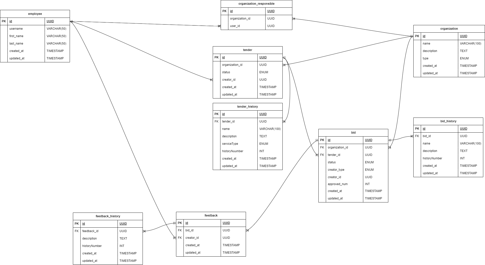

## Структура  
Приложение написано на python с использованием fastapi, sqlalchemy, postgres. В директории tenders расположен весь код проекта.  
  
Использовалась трехуровневая архитектура:
1. Слой данных расположен в директории tenders/db. В директории models расположены модели для sqlalchemy. Миграции применяются при помощи alembic, описания находятся в директории migrator.
2. Слой бизнес-логики расположен в директории tenders/utils.
3. Слой клиента расположен в директориях tenders/endpoints и tenders/schemas.

## Схема базы данных
Предполагается, что изначально база данных находится в состоянии с созданными таблицами employee, organization, organization_responsible

## Запуск приложения
В корне проекта находится dockerfile. Для сборки контейнера выполните команду в корне проекта



```
docker build -t avito .
```

Так же приложение можно использовать в docker-compose файле для связки с postgres, необходимо задать переменные окружения из условия для подключения. Приложение будет доступно по порту 8080. По пути 127.0.0.1:8080/swagger можно получить swagger